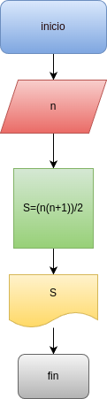

# Programa #1
programa para sumar los primeros numeros naturales

# Analisis

## Input
### Variables de entrada
n: valor a ingresar 
### processing
S: suma de los_n_primeros numeros

### output
S= (n*(n+1))/2
# Diseño

# Construcion 

